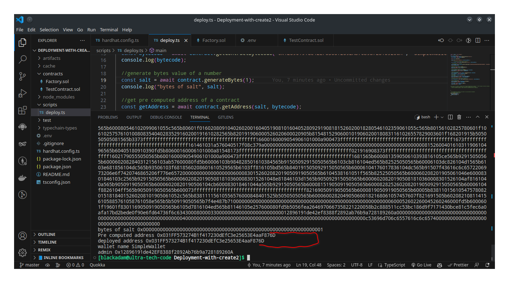

# Deploying contract with create2 on CELO

---

## Introduction

The following article offers a thorough steps on Solidity create2 opcode to precompute the address of a smart contract. I'll describe the technical steps required in using create2 opcode in a smart contract in great detail. 
<br/>
create2 is an opcode that is used to predict the address of a contract before depployment. It precompute the address of a contract without deploying it.

In eip-1014 (https://eips.ethereum.org/EIPS/eip-1014), create2 was introduced.

## Table of Contents

- [Deploying contract with create2 on CELO](#Deploying-contract-with-create2-on-CELO)
  - [Introduction](#introduction)
  - [Table of Contents](#table-of-contents)
  - [Objective](#objective)
  - [Prerequisites](#prerequisites)
  - [Requirements](#requirements)
  - [What is create2 Opcode?](#What-is-create2-Opcode)
    - [Benefits of using a create2?](#benefits-of-using-create2)
    - [Differences between create and create2?](#Differences-between-create-and-create2?)
  - [Tutorial](#tutorial)
    - [STEP 1 - Set up Hardhat Environment](#step-1---setup-hardhat-environment)
    - [STEP 2 - Create your Smart contracts](#step-2---create-your-smart-contracts)
      - [Factory contract file Explained](#Factory-contract-file-explained)
      - [Minimal Proxy Contract Explained](#minimal-proxy-contract-explained)
    - [STEP 3 - Deploying your contracts](#step-3---deploying-your-contracts)
    - [STEP 4 - Verifying your contracts](#step-4---verifying-your-contracts)
    - [STEP 5 - Interacting with the deployed contracts](#step-5---interacting-with-the-deployed-contracts)
      - [Making a clone of the multisig wallet contract](#making-a-clone-of-the-multisig-wallet-contract)
    - [Conclusion](#conclusion)

## Objective

By the end of this Article you should be able to write a contract and Deploy it with create2 on the CELO Blockchain

## Prerequisites

- Understanding of Solidity: It is important to have a strong understanding of Solidity as it is the main programming language for creating smart contracts on Celo blockchain.

- Command line proficiency: Basic familiarity with using command line tools such as Terminal or Command Prompt is necessary for running commands and scripts.

- Proficiency in Hardhat: It is essential to have a good grasp of using Hardhat, a development environment designed for writing, testing, and deploying smart contracts on the Celo blockchain.

## Requirements

- A text editor: For this tutorial, we will make use of Visual Studio Code.
- You will need to have node.js installed on your system, with version V10. or higher.
- npm (node package manager) used for installing and managing dependencies.

## What is create2 Opcode?

Before we dive into how to use create2 opcode, let's first understand what it is. create2 is an Ethereum Virtual Machine (EVM) opcode that creates a new contract at a deterministic address based on the contract's bytecode, a unique salt value, and the hash of the code. The create2 opcode was introduced in the Constantinople hard fork in February 2019.

The create2 opcode is different from the traditional create opcode, which creates a new contract at a random address. The create2 opcode is deterministic and allows developers to calculate the contract address before deploying the contract.

How to Use create2 Opcode?

To use create2 opcode, we need to define three parameters: the bytecode of the contract, a unique salt value, and the hash of the code. The bytecode of the contract is the compiled version of the smart contract code. The salt value is a random number that is generated by the developer. The code hash is the hash of the bytecode of the contract.

### Benefits of using create2

1. **Deterministic contract creation:**: **create2** allows developers to create smart contracts at deterministic addresses. This means that the address of the contract can be calculated before deployment, making it easier to interact with the contract.

2. **Cost savings**: By using **create2** to create contracts, developers can save on gas fees. Since the contract address can be calculated before deployment, the contract can be created in a single transaction, which reduces the number of transactions required to deploy a contract.

3. **Improved user experience**: Since the address of the contract is deterministic, users can easily predict the address of the contract and interact with it more easily.

4. **Contract upgradeability**: By using **create2**, developers can create contracts that can be upgraded without changing the contract address. This is because the new contract can be created with the same salt value as the old contract, which ensures that it has the same address.

5. **Better security**: Since the contract address can be calculated before deployment, **create2** can be used to create contracts that are more secure and resistant to attacks. By precomputing the contract address, the contract can be deployed without revealing the contract code or the salt value, which can help prevent potential attacks.

 NB: If you try to deploy twice, it reverts. you can only deploy a contract with the same bytescode and the same salt once
### Differences between create and create2

With the **CREATE"** opcode the address is determined by the factory contract's nonce.  Factory nonce is increased by 1 Everytime CREATE is called while 
With the **create2** opcode creates a new contract at a deterministic address based on the provided salt value. The address is not dependent on the the nonce of the factory when it's called.

In this tutorial, we will be making use of the Cloned factory pattern.

## Tutorial

### STEP 1 - Set up Hardhat Environment

To begin setting up the Hardhat environment for your smart contract implementation, you will first need to create a new folder on your system. You can do this by using the ‘mkdir’ command in your terminal followed by the desired name of your folder. For example:

```
mkdir Deployment-with-create2
```

Next, navigate to your project folder using the ‘cd’ command, like so:

```
cd Deployment-with-create2
```

Once you have cd into the folder, you can initialize a new npm project inside it by running the following command:

```
npm init -y
```

This will create a “package.json” file in your project folder with default settings.
Run the following command to initialize the Hardhat environment and create some default configuration files and folders required for building and testing smart contracts.

```
npm install hardhat --save-dev
npx hardhat
```

We will be using a typescript project for this tutorial, so click on “Create a typescript project” and enter this and other prompt options.
<br/>

Finally, open your project folder in VScode by running this command in your terminal:

```
code .
```

This will open up your project folder in Visual Studio Code, where you can start setting up your Hardhat environment and writing your smart contract code.
<br/>

### STEP 2 - Create your Smart Contracts

In the root directory of your project, you'll find a folder called "contracts". To create a new TypeScript file, simply navigate to this folder and add your new files.
<br/>

For this tutorial, we'll need to To create these two contracts files:

- Factory contract file
- TestContract contract file

#### Factory contract Explained

```solidity
// SPDX-License-Identifier: MIT
pragma solidity ^0.8.0;

import "./TestContract.sol";

contract Factory {

    event DeployedContract(address indexed contractAddress);

    /**
     * @notice  . A function to Get bytecode of contract to be deployed
     * @dev     . returns bytes [bytes of TestContract + constructor argument]
     * @param   _owner  . An address[TestContract constructor arguments]
     * @param   _name  . A string[TestContract constructor arguments]
    */
    function getContractBytecode(address _owner, string calldata  _name) public pure returns (bytes memory) {
        bytes memory bytecode = type(TestContract).creationCode;

        return abi.encodePacked(bytecode, abi.encode(_owner, _name));
    }


    /**
     * @notice  . A function to Compute address of the contract to be deployed
     * @dev     . returns address where the contract will deployed to if deployed with create2
     * @param   salt: unique bytes used to precompute an address
    */
    function getAddress(bytes32 salt, bytes memory bytecode) public view returns (address) {
        address predictedAddress = address(uint160(uint(keccak256(
            abi.encodePacked(
                bytes1(0xff),
                address(this), 
                salt, 
                keccak256(bytecode) 
            )
        ))));
      
        return predictedAddress;
    }


    /**
     * @notice  . A function to create Contract using create2
     * @dev     . returns address of the new contract. revert if called with the same parameter more than once
     * @param   salt  . A unique bytes used to precompute an address
     * @param   bytecode  .byte code of the contract to be deployed
    */
    function createContract(bytes32 salt, bytes memory bytecode) public{
        address contractAddress;
        assembly {
            contractAddress := create2(0, add(bytecode, 0x20), mload(bytecode), salt)
            if iszero(extcodesize(contractAddress)) {
                revert(0, 0)
            }
        }

        emit DeployedContract(contractAddress);
    }

     /**
     * @notice  . An helper function to get the bytes32 value of a number
     * @dev     . returns bytes32
     * @param   _salt  . A unique uint value
    */
    function generateBytes(uint _salt) external pure returns(bytes32){
        bytes32 salt = bytes32(_salt);
        return salt;
        
    }
}
```

The Breakdown of the contract:

- The License was specified
- The solidity version was set
- The contract that we are deploying [Testcontract] is imported.

- getContractBytecode() function returns the bytecode of the contract we want to deploy.
bytecode is what the evm understand, our solidity code is compiled to bytecode and stored on the evm so we can interract with it.
It takes in the constructor argument of the contract we want to get the bytecode and encode the contract bytecode with the constructor parameter passed in to the function.

- getAddress() function returns the Computed address of the contract to be deployed
It takes in the bytecode of the contract that we want to deploy and the salt.
Let's break down the formula to understand it better:

1. **byte(0xff):**: is the first byte of the byte array that is used to create the contract.

2. **address(this)**: is the address of the current(factory) contract

3. **salt**: is the unique salt value that is generated by the developer.

4. **keccak256(bytecode)**: is the hash of the bytecode of the contract.

5. **abi.encodePacked()**:  is a function that concatenates the input arguments and returns bytes.

6. **keccak256()**:   is a function that computes the SHA-3 hash of the input.

5. **aaddress(uint160(uint(keccak256...)))**:  computes the address of the contract by taking the last 20 bytes of the hash.

- createContract() function  takes in two parameters: the `salt` and the `bytecode` of the contract. The **createContract()** function creates a new contract at a deterministic address based on the salt and bytecode using create2 opcode.

Inside the createContract() function, we define a contractAddress variable to hold the address of the new contract. We then use assembly code to call the `create2` opcode to create the new contract. The assembly code takes in four parameters: 0 (value), `add(bytecode, 0x20)` (memory pointer to the bytecode), `mload(bytecode)`(length of the bytecode), and the `salt` value.

The if `iszero(extcodesize(contractAddress))` statement checks if the contract was successfully created. If the contract was not successfully created, the function reverts.

Finally, the `DeployedContract` event is emitted with the address of the new contract.

- generateBytes() function is an helper function to compute the bytes32 value of any unsigned integer.

#### TestContract Explained

```solidity
// SPDX-License-Identifier: MIT
pragma solidity ^0.8.0;

contract TestContract {

    /** State Variable**/
    string public walletName;
    address public admin;


    // Modifier to check for caller of a function. It restrict Access to owner/admin
    modifier onlyAdmin() {
        require(admin == msg.sender, "Caller is not the owner");
        _;
    }

    /** 
    * @notice  constructor .runs on deployemnt of the contract. 
    * @param   _owner  . The Address of the admin/owner,
    * @param   _walletname  . The wallet name 
    **/
    constructor(address _owner, string memory _walletname) payable {
        admin = _owner;
        walletName = _walletname;
    }
    
    /**
     * @notice  . A function to transfer ownership to another user
     * @dev     . only admin/owner can call the function
     * @param   _newAdmin  . The Address of the new admin/owner
     */
    function transferOwnership(address _newAdmin) external onlyAdmin {
        admin = _newAdmin;
    }

    /**
     * @notice  . A View Function to get the ether balance of the contract
     * @dev     . returns ether balance of the contract
     */
    function getBalance() public view returns (uint256) {
        return address(this).balance;
    }

    /**
     * @notice  . A Function to withdraw the ether balance of the contract
     * @dev     . Only admin/owner can call the function
     */
    function withdraw() external onlyAdmin {
        payable(msg.sender).transfer(address(this).balance);
    }

    /**
     * @notice  . A Function to receive ether sent directly to this contract without a function call.
     * @dev     . similar to a fallback function.
     */
    receive() external payable{}
}
```
- `TestContract` is a simple wallet contract.

### STEP 3 - Deploying your contracts

Before deploying your contract to the Celo testnet, ensure that you have added the Celo testnet RPC to your Metamask wallet, if not follow this [guide](https://docs.celo.org/blog/tutorials/3-simple-steps-to-connect-your-metamask-wallet-to-celo) to add it & also get faucet from this [site](https://faucet.celo.org/alfajores).
<br/>

Next, add the Celo network configuration to the hardhat.config.ts file located in the root directory of your project. To enable the use of your private key for your Celo account during contract deployment, you will need to install an env file. You can store your private key in the ".env" file and use the dotenv package to load it into your Hardhat configuration. Here is an example of how to configure it:

- Install the dotenv package:

```
npm install dotenv
```

- Create a .env file in the root directory of your project, paste your private key, and ETHERSCAN_API_KEY into it:

```
PRIVATE_KEY=<your-private-key>
ETHERSCAN_API_KEY = <ETHERSCAN_API_KEY>
```

Here’s an example of how to add the Celo network configuration to your hardhat.config.ts file:

```typescript
import { HardhatUserConfig } from "hardhat/config";
import "@nomicfoundation/hardhat-toolbox";
require("dotenv").config();


type HttpNetworkAccountsUserConfig = any;
const config: HardhatUserConfig = {
  solidity: "0.8.0",
  networks: {
    alfajores: {
      url: "https://alfajores-forno.celo-testnet.org",
      accounts: [process.env.PRIVATE_KEY] as HttpNetworkAccountsUserConfig | undefined,
      chainId: 44787,
    }
  },
  etherscan: {
    apiKey: process.env.ETHERSCAN_API_KEY
  }
};

export default config;

```

Next thing is to write our deploy scripts like so;

```typescript
import { ethers } from "hardhat";

async function main() {
  const Factory = await ethers.getContractFactory("Factory");
  const factory = await Factory.deploy();

  await factory.deployed();

  console.log(`factory deployed to ${factory.address}`);

         /** Interact with the factory contract */
  const contract = await ethers.getContractAt("Factory", factory.address);

    //Get bytecode of a contract
  const bytecode = await contract.getContractBytecode("0x12896191de42EF8388f2892Ab76b9a728189260A", "SimpleWallet");
  console.log(bytecode);

  //generate bytes value of a number
  const salt = await contract.generateBytes(1);
  console.log("bytes of salt", salt);

  //get pre computed address of a contract
  const getAddress = await contract.getAddress(salt, bytecode);
  console.log("Pre computed address", getAddress);

  //deploy the contract
  const createContract = await contract.createContract(salt, bytecode);
  const txreceipt =  await createContract.wait()
  //@ts-ignore
  const txargs = txreceipt.events[0].args;
  //@ts-ignore
  const contractAddress = await txargs.contractAddress
  console.log("deployed address", contractAddress);

  /**Interact with the simple wallet contract */
  const TestContract = await ethers.getContractAt("TestContract", contractAddress);

  //Get the wallet Name
  const walletName = await TestContract.walletName();
  console.log("wallet name", walletName);

  const admin = await TestContract.admin();
  console.log("admin", admin);


/**if you try to create a contract with the same bytecode and salt again. It revert because "Contract already created"*/
//to deploy a replica of the contract, you need to change the salt value
  //const createContractagain = await contract.createContract(salt, bytecode);


}

// We recommend this pattern to be able to use async/await everywhere
// and properly handle errors.
main().catch((error) => {
  console.error(error);
  process.exitCode = 1;
});

```

First, let's compile our smart contract using this command line in our VSCode terminal:

```
npx hardhat compile
```

Then, let’s deploy our contract using this command line in our VSCode terminal:

```
npx hardhat run scripts/deploy.ts --network alfajores
```



### Step 5 — Verifying your contracts

To verify your contracts on the Celo Explorer, you can follow these steps:
<br/>

After your contract has been deployed, go to the [Celo Explorer](https://alfajores.celoscan.io/) and paste the contract’s address into the search field.
<br/>

After locating the address of the contract, select the “Contract” button and proceed to click on “Verify and Publish” in order to initiate the verification process.


Fill in the required information, such as the compiler version used to deploy your contract, the compiler type, and so on.


After clicking "Continue," you will be directed to another page. To authenticate your smart contract, you need to copy and paste its code into the "Enter the Solidity Contract Code below" field. If your contract's constructor function required arguments during deployment, you must also obtain and paste the ABI-encoded argument into the "Constructor Arguments ABI-encoded" field. If no arguments were provided during deployment, you can skip this step.As the contracts used in this tutorial do not contain a constructor function, we can skip that step.
<br/>

Submit the verification request by clicking the “Verify and Publish” button , and wait for it to be processed. This usually takes a few seconds.
<br/>

After successfully verifying your smart contract, you should be able to see it on the Celo Explorer with a green checkmark indicating that it has been verified.


You can do the same for the Minimal Proxy Factory as well.

- [Multisig Wallet Contract on Celo Testnet Explorer](https://alfajores.celoscan.io/address/0x1844549ed4d5380d38cfe3d873376d988b6379c8#code)
- [Minimal Proxy Factory Contract on Celo Testnet Explorer](https://alfajores.celoscan.io/address/0xb08cbfc3f899628622b69f2f5002be435f3c7c75#code)

### STEP 5 - Interacting with the deployed contracts

After the successful verification and deployment of your smart contract, the subsequent phase involves interacting with it, which often entails utilizing a Web3 interface to invoke the functions specified in the contract and work with its data. In this tutorial, we will leverage Celo Explorer to interact with our smart contract.

#### Making a clone of the multisig wallet contract

Navigate to the Minimal Proxy Factory Contract on Celo Testnet [Explorer](https://alfajores.celoscan.io/address/0xb08cbfc3f899628622b69f2f5002be435f3c7c75#code) and click on the "Write Contract" button, then click on "Connect to web3" which will prompt you to either connect to MetaMask or WalletConnect, chose the wallet you are using here.


<br/>

To create a clone of the multisig contract, we need to pass 3 arguments, which are;

- The implementation contract address(Multisig wallet contract address)
- Array of valid owners for the new clone we want to create
- \_quorum(the number of approvals required for a transaction to be executed in the multisig).

Pass in the necessary arguments , and click on the "write" button to confirm the transaction on metamask.


To read your minimal proxy contract and obtain the addresses of the newly created clones, click on the "Read Contract" button and read any function of your choice like so:


Click on the getCloneAddress() and pass an index of 1 to get the first created multisig wallet clone address which you can find [here](https://alfajores.celoscan.io/address/0x331E6b11e985BADEBF94de88dF17E1345C814d1F#code).
<br/>

Now, let's interact with the created multisig wallet clone contract.

- Click on the “Write Contract” tab in Celo Explorer.
- Connect to your Celo wallet by clicking on the “Connect Wallet” button and choosing your wallet provider.
- Select the function you want to write to and fill in any required parameters.
- Click the “Write” button to send the transaction to the blockchain.
- Review the transaction details and confirm the gas fee.

If you try to initialize the created clone, you should see something like this;


The reason for this is that the contract was initialized through the minimal proxy factory and its implementation was designed to prevent the state of the contract from being initialized twice, which could potentially lead to an attack on the contract.

**Requesting a transaction**
<br/>

Only an address that belongs to the valid owners is able to successfully request a transaction. If any address outside of the valid owners attempts to interact with these functions, the transaction would fail and revert.


**Approving a transaction**
<br/>

To validate and approve a transaction, only the designated owners who were added during the contract creation are authorized to do so. If an address that is not a valid owner attempts to trigger the approve function, the transaction approval process will fail. Additionally, before a transaction can be executed, the quorum set must be reached, meaning that the minimum required number of owners must approve the transaction.


You can then proceed to reading the state of the contract after writing to it.
<br/>

To create your own Minimal Proxy Multisig contract, you can replicate the following steps. By doing so, you will be able to deploy the contract and interact with it through celo explorer in a successful manner. Additionally, it is important to note that proper understanding and execution of these steps is crucial for ensuring the security and functionality of your contract.

### Conclusion

In conclusion, the minimal proxy multisig contract provides an efficient and secure way for multiple parties to manage their assets and make decisions on the Celo platform. By utilizing minimal proxy contracts, the deployment and maintenance costs are reduced, while the flexibility and control of the multisig functionality remain intact. It is important to carefully consider the ownership structure and security measures when deploying this type of contract to ensure the safety of the assets and the integrity of the decision-making process. I appreciate you staying till the end, and I trust that you have gained valuable insights from this tutorial.
<br/>

The link to my project repository can be found [here](https://github.com/Sayrarh/Multi-Sig-Minimal-Proxy-on-Celo).
